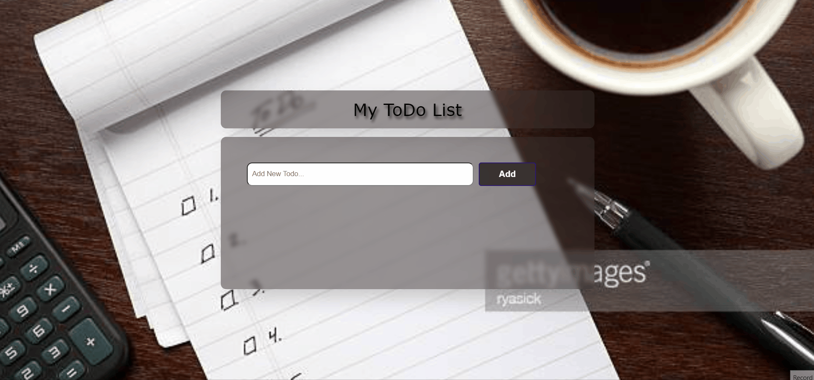

[👉 click here to view the page](https://msaiduslu.github.io/To-Do-List-App/)

# Project : To-Do List App

Project aims to create a simple To-Do App.

## Project Skeleton

```
002-To-Do App (folder)
|
|----readme.md
|----index.html
|----style.css
|----App.js
```

### At the end of the project, i will be able to;

- improve coding skills within HTML & CSS & JS

- use git commands (push, pull, commit, add etc.) and Github as Version Control System.
